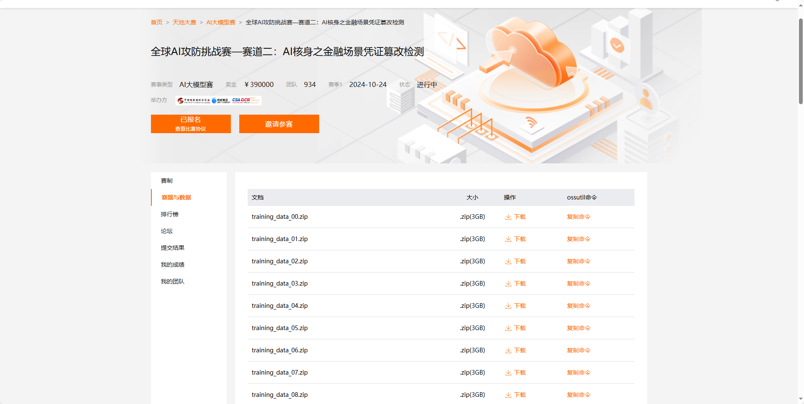
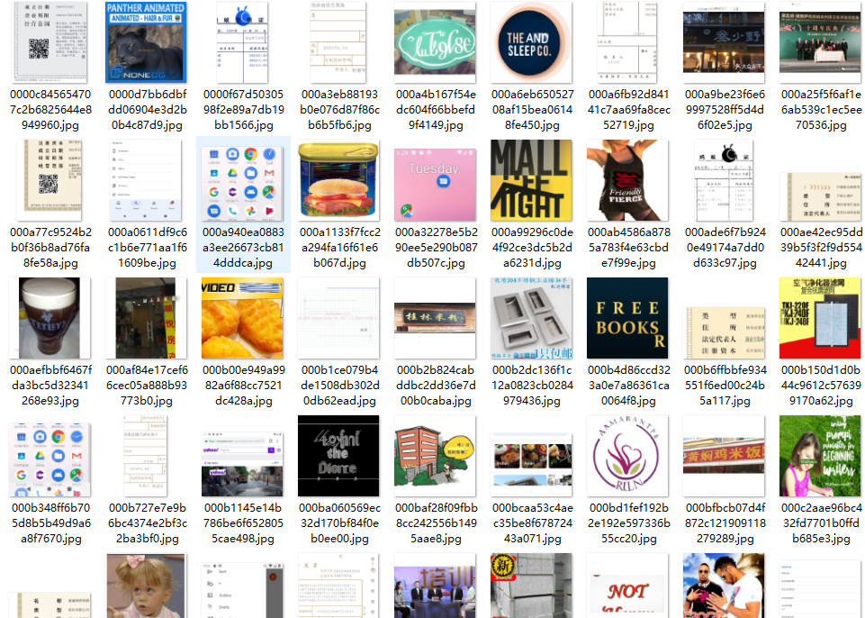
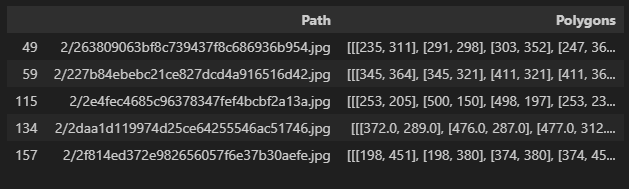
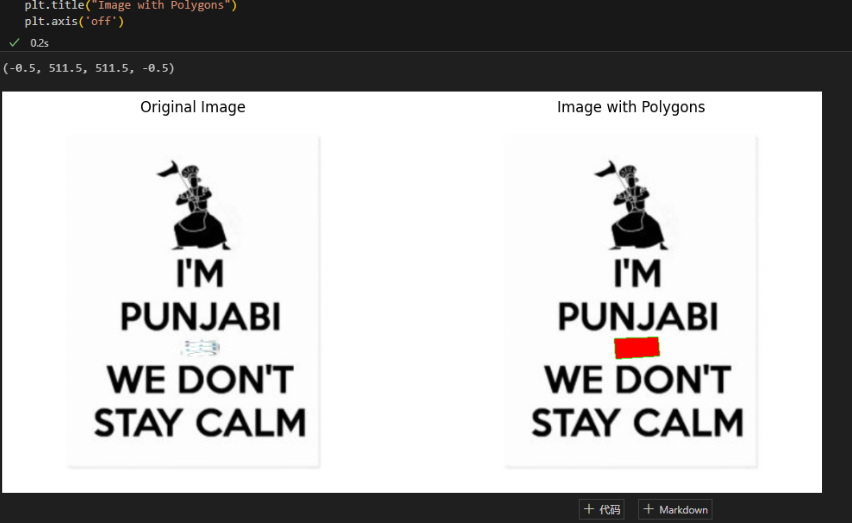
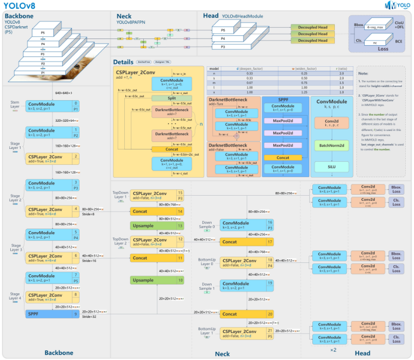
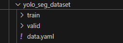
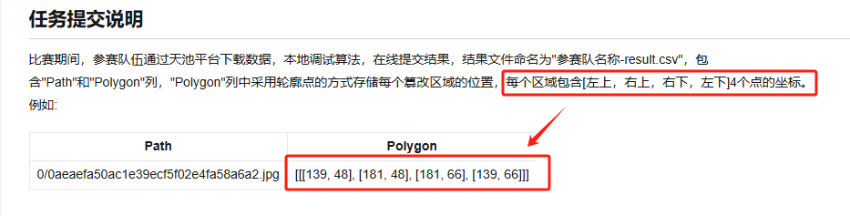
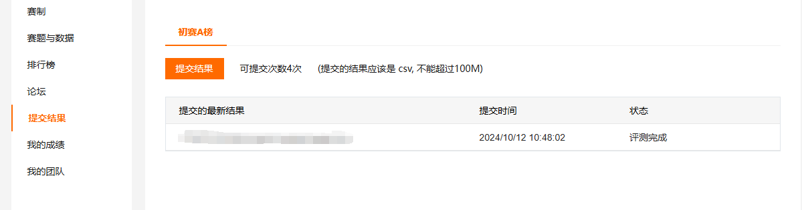

# **全球AI攻防挑战赛—赛道二：AI核身之金融场景凭证篡改检测**

***

## 学习参考

比赛报名地址：[赛事报名](https://tianchi.aliyun.com/s/24acb952f488f1f713a5294cf585bea3)

<font color="blue"> 赛事说明：</font>AI攻防挑战赛基于发布大规模的凭证篡改数据集，可以通过目标检测、语义分割等图像处理的方式在给定的大规模篡改数据集上进行模型研发，最终在测试集上对比检测精度。

## Task01 搭建自己的第一个baseline

首先介绍一下完成此次baseline我所使用的工具：

> VScode：[Visual Studio Code - Code Editing. Redefined](https://code.visualstudio.com/)
>
> 显卡：老旧不堪的本地3090

首先了解赛题，登录官网发现官方提供了大量的数据以供选择：




由于本地资源有限，因此baseline只选择使用了training_data_00.zip进行实验：

实验设计可以分为以下几个步骤：

### 1. 数据读取

解压缩数据集文件夹后发现是大量的含有篡改信息的图像，对应的篡改信息标注位置在官网的training_anno.csv.zip中



所以我们首先对数据集进行读取，将图像路径与标注信息对应：

```python
import os, shutil
import cv2
import glob
import json
import pandas as pd
import numpy as np
import matplotlib.pyplot as plt

training_anno = pd.read_csv('./seg_risky_training_anno.csv')

train_jpgs = [x.replace('./', '') for x in glob.glob('./0/*.jpg')]
training_anno = training_anno[training_anno['Path'].isin(train_jpgs)]
training_anno['Polygons'] = training_anno['Polygons'].apply(json.loads)

training_anno.head()
```



任意读取其中的一组图片进行可视化

```python
idx = 23
img = cv2.imread(training_anno['Path'].iloc[idx])

plt.figure(figsize=(12, 6))
plt.subplot(121)
plt.imshow(img)
plt.title("Original Image")
plt.axis('off')

plt.subplot(122)
img = cv2.imread(training_anno['Path'].iloc[idx])
polygon_coords = np.array(training_anno['Polygons'].iloc[idx], dtype=np.int32)

for polygon_coord in polygon_coords:
    cv2.polylines(img, np.expand_dims(polygon_coord, 0), isClosed=True, color=(0, 255, 0), thickness=2)
    img= cv2.fillPoly(img, np.expand_dims(polygon_coord, 0), color=(255, 0, 0, 0.5))

plt.imshow(img)
plt.title("Image with Polygons")
plt.axis('off')
```



### 2. 构建baseline模型

我选用的是工业界比较火热的YOLOv8的模型作为baseline：[Ultralytics (github.com)](https://github.com/ultralytics)



基于这个模型，将已经读取到的数据集进行划分之后分别作为训练集和验证集（测试集是官方提供的不需要自行划分）：



接下来就是自定义训练设置进行训练，包括epoch、batch-size、是否启用mosaic、optimizer等

### 3. 测试

完成训练之后，用保存的.pt权重，对测试集的图像进行测试，并将结果保存在csv文件中提交到赛事官网进行验证：

```python
from ultralytics import YOLO
import glob
from tqdm import tqdm

model = YOLO("./best.pt")  

test_imgs = glob.glob('./test_set_A_rename/*/*')
```

在生成csv文件的时候注意有一个官网的注意事项：




因此可以如下设计代码：

```python
import numpy as np
Polygon = []
for path in tqdm(test_imgs[:10000]):
    results = model(path, verbose=False)
    result = results[0]
    if result.masks is None:
        Polygon.append([])
    else:
        image_polygons = []
        for mask in result.masks.xy:
            mask_coords = np.array(mask)

            x_min = np.min(mask_coords[:, 0])
            x_max = np.max(mask_coords[:, 0])
            y_min = np.min(mask_coords[:, 1])
            y_max = np.max(mask_coords[:, 1])

            bounding_box = [
                [x_min, y_min],  # left top
                [x_max, y_min],  # right top
                [x_max, y_max],  # right down
                [x_min, y_max],  # left down
            ]
            image_polygons.append(bounding_box)


        Polygon.append(image_polygons)
```

最后按要求提交结果即可（每天可以提交五次）



